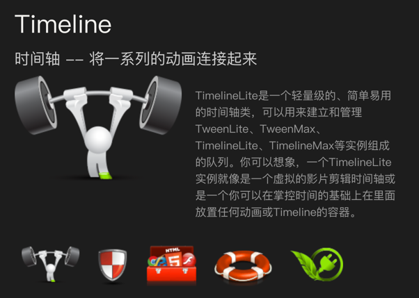

## 简介

时至今日在Web中开发动效有很多种方式，有纯CSS的方式（Animations和Transitions），

也有Web Animation API和SVG Animation，还有很多优秀的JavaScript库（比如，Anime.js、KUTE.js、Mo.js等）。

在WebGL方面有Three.js、PixiJS、Babylon.js和PlayCanvas等。

除此之外，业内还有一个制作动画非常出色的平台，那就是GSAP（GreenSock Animation Platform的简称）

GSAP是GreenSock提供的一个制作动画的成熟的JavaScript库，该库源于Flash的动画。

这也意味着GreenSock背后的人对Web动画了如指掌，这个库已经存在很长的时间了，而且不会很快消失。

GSAP中有很多工具和插件，我们可以利用它们来快速开发Web动画和快速处理开发Web动画遇到的任何挑战。

除了GSAP具有强大的特性、工具和插件之外，而且学习曲线也相对较浅，因为它在所有不同的实现和插件中使用了直观且一致的语法。此外， [GSAP论坛](https://greensock.com/forums/) 还提供了很棒的文档、教程等。


## 1 为什么选择GSAP

* 速度快： GSAP专门优化了动画性能，使用实现和CSS一样的高性能动效
* 轻量和模块化： 模块化与插件式的结构保持了GSAP核心引擎的轻量，TweenLite包非常的小。GSAP还提供了 TweenLite、 TimelineLite、 TimelineMax、 TweenMax等功能动画模块，在使用的时候可以按需加载
* 没有依赖： 使用GSAP开发动效时不需要依赖于任何第三方库或插件
* 灵活控制： 不用受限于线性序列，可以重叠动画序列，你可以通过精确时间控制，灵活地使用最少的代码实现动效
* 任何对象都可以实现动画，只要能运行JavaScript脚本的地方就可以使用GSAP

GSAP也非常的灵活，可以适用于你给它的任何东西。也就是，GSAP可以让下面这些东东都动起来：

* CSS： CSS中的2D和3D方面的transform、color、width、opacity、border-radius、margin等，几乎所有的CSS属性都可以
* SVG： SVG中的一些属性，比如viewBox、width、height、fill、stroke、cx、r、opacity等，而且借助像 MorphSVG 和 DrawSVG这样的GSAP插件，还可以实现一些高级的效果
* 任何数值，比如<canvas>的对象，3D动画场景中的摄像机位置和滤镜值

一旦你学习了GSAP相关的基本语法，就能够在任何可运行JavaScript脚本的地方使用GSAP。
如果你也比较关注DOM元素的CSS属性的动画，在使用GSAP时，还可以在React、Vue等前端框架中使用。

## 2 文档

* [https://greensock.com/](https://greensock.com/)
* [https://greensock.com/gsap/](https://greensock.com/gsap/)

## 3 GSAP核心模块

GSAP有几大核心模块，它们是：

* TweenLite：GSAP的基础，一个轻量级和快速的HTML5动画库
* TweenMax：TweenLite的扩展，除了包括TweenLite本身之外，还包括TimelineLite、TimelineMax、CSSPlugin、AttrPlugin、RoundPropsPlugin、DirectionalRotationPlugin、BezierPlugin和EasePack
* TimelineLite：一种轻量级的Timeline，用于控制多个Tween和（或）其他Timeline
* TimelineMax：一个增强版的TimelineLite，它提供了额外的、非必要的功能，如repeat、repeatDelay和yoyo等等

## 4 [加载 GSAP 的方式](https://greensock.com/docs/v3/Installation#CDN)

使用 [CDN]() 方式


图片出自 [w3cplus](https://www.w3cplus.com/animation/GSAP-for-beginner.html)

使用 [NPM](https://greensock.com/docs/v3/Installation?checked=core#modules) 方式


图片出自 [w3cplus](https://www.w3cplus.com/animation/GSAP-for-beginner.html)

## 5 简单的小demo

html
```html
<h2 class="title">gsap.to() Basic Usage</h2>
<div class="box orange" data-wx-url="https://"></div>
<div class="box grey"></div>
<div class="box green"></div>
<script type="module" src="./index.js"></script>
```
js
```js
import {gsap} from "gsap";

gsap.to("h2.title", {duration: 1, display: 'block', opacity: 1});
gsap.to(".box", {duration: 2, x: 300});
gsap.to(".green", {duration: 3, rotation: 360, scale: 0.5});
```

常用的动画属性
* x：相当于CSS的transform: translateX()，即元素在x轴移动
* scale：相当于CSS的transform: scale()，即元素放大或缩小
* duration：相当于CSS的animation-duration，动画播放的持续时间
* paused：是设置动画的状态

### 5.1 开启3D
js
```js
gsap.to(".green", {
    duration: 3,
    force3D: true,
    transformPerspective: 500,
    rotation: "-170_short",
    rotationX: 45,
    scaleX: 0.8,
    transformOrigin: "left top",
    y: 50,
    z: -300
});
```

### 5.2 特定的旋转方向

特定方向的 CSS 属性的 Tweens 旋转可以是顺时针（后缀）、逆时针（后缀）或最短方向（后缀），
在这种情况下，插件会根据最短路径为你选择方向。

* "_cw" 顺时针
* "_ccw" 逆时针
* "_short" 最短方向

```js
gsap.to(".green", {
    duration: 3,
    // rotation: "170_cw", // 顺时针
    // rotation: "170_ccw", // 逆时针
    // rotation: "60_short", // 最短路径
    rotation: "300_short", // 最短路径
});
```
### 5.3 相对值

有些时候我们可能不清楚元素当前是否已经有translate，但就是想让元素相对它原本的位置移动一段距离，这时可以用相对值

```js
gsap.to(".green", {
    duration: 3,
    rotation: "+=170"
});
```

### 5.4 autoAlpha

autoAlpha是opacity和visibility这2个css属性的结合

什么要结合起来呢？一般来说，opacity为0的不可见元素，我们会认为它也是不可交互的（比如onclick不触发），因此附加visibility: hidden可以保证这一点。
GSAP会正确处理动画过程中这2个css属性的变化。
```js
gsap.to(".green", {
    duration: 3,
    autoAlpha: 0 // autoAlpha: 1 
});
```

### 5.5 清除属性
```js
gsap.from(".green", {
    duration: 5, 
    scale: 0, 
    left: 200, 
    backgroundColor: "red", 
    clearProps: "scale,left" // note: "scale" (or any transform-related property) clears all transforms
});
```

### 5.6 GSAP 不仅仅用于 DOM 元素，还可以为原始对象的自定义属性设置动画

```js
var obj = {prop: 10};
gsap.to(obj, {
  duration: 1,
  prop: 200, 
  //onUpdate fires each time the tween updates; we'll explain callbacks later.
  onUpdate: function() {
    console.log(obj.prop); //logs the value on each update.
  }
});
```

### 5.7 GSAP 设置动画状态

```js
const handlePlay = document.getElementById("play");

const tween = gsap.to(".green", {
    duration: 2, x: 200, scale: 2, paused: true,
    onComplete() {
        console.log(tween)
    }
});

handlePlay.addEventListener("click", () => {
    tween.play();
    setTimeout(() => {
        tween.pause()
        console.log('当前进度', tween.progress())
    }, 300)
});
```

### 5.8 GSAP 设置动画状态

```js
const handlePlay = document.getElementById("play");

const tween = gsap.to(".green", {
    duration: 2, x: 200, scale: 2, paused: true,
    onComplete() {
        console.log(tween)
    }
});

handlePlay.addEventListener("click", () => {
    tween.play();
    setTimeout(() => {
        tween.pause()
        console.log('当前进度', tween.progress())
    }, 300)
});
```

### 5.9 设置默认的参数

```js
gsap.defaults({ ease: "power2.in", duration: 1 });

gsap.config({
    autoSleep: 60,
    force3D: true,
    nullTargetWarn: false,
    units: {x: "vw", y: "vh"}
});
```

示例：
* [官方的示例](https://www.tweenmax.com.cn/demo/)
* [codepen](https://codepen.io/airen/pen/RwrdaBY)

## 6 TimeLine 时间轴

时间轴是GreenSock 动画平台中的动画组织、排序、管理工具，可创建时间轴（timeline）作为动画或其他时间轴的容器，这使得整个动画控制和精确管理时间变得简单。

试想一下，如果不使用时间轴，那么构建复杂的动画序列将会非常麻烦，因为你需要用delay为每个动画设置开始时间。

### 6.1 直接看例子

```html
<div id="content">
    <h1>Timeline</h1>
    <h2>时间轴 -- 将一系列的动画连接起来</h2>
    <div id="info">
        
        <p id="description">
            TimelineLite是一个轻量级的、简单易用的时间轴类，可以用来建立和管理TweenLite、TweenMax、TimelineLite、TimelineMax等实例组成的队列。你可以想象，一个TimelineLite实例就像是一个虚拟的影片剪辑时间轴或是一个你可以在掌控时间的基础上在里面放置任何动画或Timeline的容器。</p>
    </div>
</div>
<div style="clear:both"></div>
<div id="nav">
    
    
    
    
    
</div>
<div id="sliderWrapper">
    <div id="slider" style="height:10px;"></div>
</div>
```


```js
let tl = gsap.timeline({repeat: 0, repeatDelay: 0.5});

tl.from('h1', 0.5, {
    left: 100,
    opacity: 0
});

tl.from('h2', 0.5, {
    left: -100,
    opacity: 0
});

tl.from('#feature', 0.5, {
    scale: .5,
    autoAlpha: 0
}, "+=0.5");

tl.from('#description', 0.5, {
    left: 100,
    autoAlpha: 0
}, "-=0.25");

// 添加一个时间节点
tl.add("stagger", "+=0.5")

tl.staggerFrom('#nav img', 0.2, {
    scale: 0,
    autoAlpha: 0
}, 0.1, "stagger");

```

具体API 请参考：[https://greensock.com/docs/v3/GSAP/Timeline](https://greensock.com/docs/v3/GSAP/Timeline)

### 6.2 文字动画

```html
<div class="text0"></div>
```

```js
import {gsap} from "../../node_modules/gsap/index.js";
import {TextPlugin} from "../../node_modules/gsap/TextPlugin.js";

gsap.registerPlugin(TextPlugin)

gsap.to('.text', {duration: 2, text: "This is the new text"});
```

### 6.3 工具
[Eases 时间曲线](https://greensock.com/docs/v3/Eases)
[贝塞尔生成工具](https://www.tweenmax.com.cn/tool/bezier/)

## 7 接下来：SVG

[https://greensock.com/docs/v3/Plugins/DrawSVGPlugin](https://greensock.com/docs/v3/Plugins/DrawSVGPlugin)
[https://greensock.com/docs/v3/Plugins/MorphSVGPlugin](https://greensock.com/docs/v3/Plugins/MorphSVGPlugin)

...

## 8 其他同类型的库

* [anime.js](https://github.com/juliangarnier/anime) [演示](https://animejs.com/documentation/#cssSelector)
* [mo.js](https://github.com/mojs/mojs) [](http://ww1.mojs.io/)
* [kute.js](https://github.com/thednp/kute.js/) [演示](http://thednp.github.io/kute.js/)
* [TweenJS](https://github.com/CreateJS/TweenJS) [演示](https://www.createjs.com/tweenjs) 是一个简单的补间库
* [Pace.js](https://github.com/HubSpot/pace) [演示](https://github.hubspot.com/pace/docs/welcome/) 网页自动加载进度条插件
* [scrollreveal.js](https://scrollrevealjs.org/) 用于创建和管理元素进入可视区域时的动画效果
* [vivus.js](https://github.com/maxwellito/vivus) [演示](http://maxwellito.github.io/vivus/) 为SVG制作动画
* [Popmotion](https://github.com/popmotion/popmotion) 

## 9 代码仓库
* [master](https://github.com/liangyuetian/gsap_started)
* [markdown](https://github.com/liangyuetian/gsap_started/blob/master/demo/text.md)

## 参考资料

* [https://greensock.com/docs/v3](https://greensock.com/docs/v3)
* [TweenMax 中文网](https://www.tweenmax.com.cn/)
* [https://www.w3cplus.com/animation/GSAP-for-beginner.html](https://www.w3cplus.com/animation/GSAP-for-beginner.html)
* [https://www.w3cplus.com/animation/gsap-timeline.html](https://www.w3cplus.com/animation/gsap-timeline.html)
